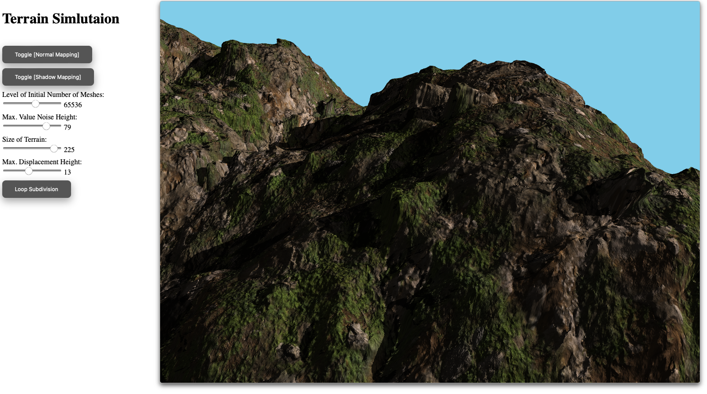

# WebGL-Terrain-Simulation with Realistic Geometry and Shadows

## Project Overview
The project is built on WebGL 2.0 and leverages Value Noise to generate terrain heights. Displacement Maps and Normal Maps are utilized to create realistic geometry. Shadow Mapping is implemented to simulate shadows using the GPU in real-time. As WebGL lacks support for tessellation shaders, a Loop Subdivision Algorithm has been implemented on the CPU. This feature allows for controlled level of detail in the geometry. A light orbits around the terrain to enhance visualization of the geometry and shadow effects.



#### Prerequisites
- Ensure you have **NPM** (Node Package Manager) installed. If not, download and install it from ([https://nodejs.org/](https://docs.npmjs.com/downloading-and-installing-node-js-and-npm)).

#### Installation
- Install TypeScript:
  ```bash
  npm install -g typescript
- Install HTTP-server globally:
  ```bash
  npm install -g http-server
- Install TypeScript definitions for OffscreenCanvas:
  ```bash
  npm install @types/offscreencanvas

#### Building and Running the Project

- Build the terrain using the provided Python script:
  ```bash
  python make-terrain.py
- Running the Project
  Start the server with no cache:
  ```bash
  http-server dist -c-1
- Launching the app by pointing your browser to http://127.0.0.1:8080
  
### GUI Controls
- `W`, `A`, `S`, `D`: Navigate forward, left, backward, and right, respectively.
- `Up` and `Down arrows`: Move vertically up and down.
- Mouse control is set to FPS mode for intuitive camera movement.

### Parameter Controls
- Level of Initial Number of Meshes: This control sets the initial quantity of meshes generated. Note that applying further subdivisions will increase the total number of meshes.
- Value Noise Height Setting: This determines the foundational height of the terrain, independent of any modifications made by the displacement map.
- Maximum Displacement Height: Increasing this value can give the terrain a rockier appearance; however, it may also introduce more visual artifacts. Applying Loop Subdivision can help smooth out the terrain when artifacts become apparent.
- Loop Subdivision: Loop Subdivision: This feature smooths the shape of the terrain. Each application quadruples the number of meshes.
- Note: Applying subdivision twice can help enhancing the quality.

### Issues
- This project has been tested on Safari. When using Chrome, shadow mapping may exhibit issues due to limited precision support for WebGL depth maps.

### Textures Paths
1. Diffusion map: `/static/assets/skinning/diff.png`
2. Normal map: `/static/assets/skinning/normal.png`
3. Displacement map: `/static/assets/skinning/dis.png`
4. Feel free to experiment with other textures for the terrain. The default textures are sourced from [Poly Haven](https://polyhaven.com/).
